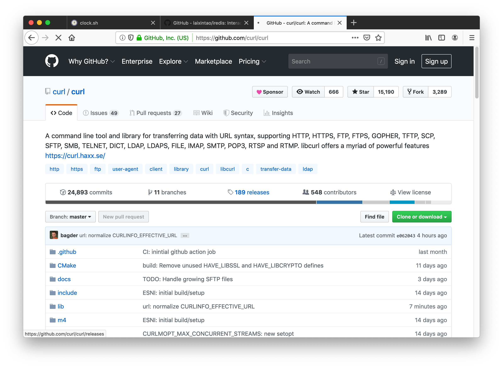
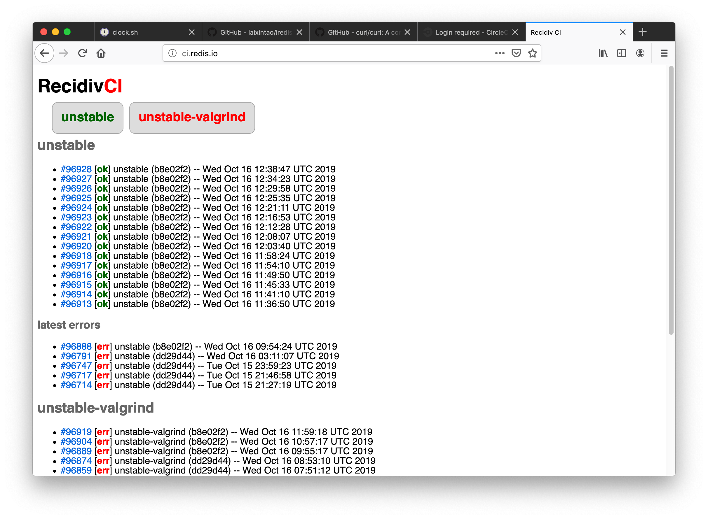

## 如何做一个Side Project

#### ---- 如何做一个体面的程序员？

### By laixintao

---

## Tip 1

### 开发你自己会用到的东西

热情、成就感、自己的需求

+++

### 我一直想做点什么，但是找不到合适的项目？

- 你自己忍受了很久的东西；
- 那些很多人在吐槽的东西；
- 你觉得应该存在，但却没有的东西；

+++

### 一个项目会生出另一个项目

- 现有的库没有满足自己的需求；
- 你觉得会有人遇到跟你一样的问题；

+++

+++

---

## Tip 2

### 保持程序可以运行

方便别人参与，更加开放和透明

+++

开源并不是某一天你完成了什么，突然变出名了。

+++

而是在开发的过程中大家不断交流和信任。

+++

## cURL

- ~200 releases(since 1997)
- 500+ contributors
- 24k+ commits

+++

## POLHEM 奖

> 一年一次的 Polhem 奖授予 Daniel.

> https://daniel.haxx.se/blog/2018/09/25/the-polhem-prize-one-year-later/

+++

瑞典国王亲自颁奖

+++

1. 用PR追踪自己的工作;
2. 尽早的将原型打包上传到 Pypi，方便别人尝试你的项目（推荐Poetry）;
3. 将一些计划或者想法赶紧用 issue 记录下来；
4. 骄傲的发布有关自己的项目的动态；

+++

Friends don't let friends pip install -r requirements.txt

---

## Tip 3

### 阅读别人的源码

代码比文档更真实，效率也更高

+++

### Qucik Question

如何比较两个版本号大小?

0.10.1 ? 0.9.2

+++

+++

1. 得到更多有用的API，更高效的使用库；
2. 习惯使用别人的lib;
3. 学习别人的代码;
4. **帮别人改进项目**.

+++

> 每一次阅读源代码，都应该让它变得更好。

+++

PR 比 fork 出来更有挑战。

可以自己先上传 fork 的一份临时package。

---

## Tip 4

### 写好测试和自动化

测试实际上是在节省时间; 无聊的工作只做一次。

+++

### 自动化繁琐的工作

---

## Tip 5

### 集中精力

不要刷测试覆盖率，不要纠结。

+++

### 10x programmer的秘诀

### 少些代码

+++

- 自动build branch
- 失败时发送邮件通知
- Web 界面
- 完全自己实现

+++

### 这样一些CI需要多少行代码？

+++

## 365行

#### 运行8年基本没有修改

---

## Tip 6

### Archive项目，Transfer

如果不想维护了怎么办？

+++

## 这很正常

- 在明显的地方告诉大家这个项目不再维护；
- 推荐这个项目的替代品；
- 将项目转交给其他人来维护；

+++

> 不要迷恋Star, star 没有什么用，就和钱一样。

---

## 总结

1. 开发你自己会用到的东西；
2. 保持一个稳定可以运行的版本；
3. 写好测试，用好自动化，无聊的工作只做一次；
4. 多读源码，去修复别人的问题；
5. Focus on your work！
6. 符号自己的责任（不要太看重star，star 没什么用，就跟钱一样）；
7. 快乐最重要；

---

## 是的！
### 快乐最重要

---

## Thanks！

Slides 在 Github 上有:

https://github.com/laixintao/side-project-slide
